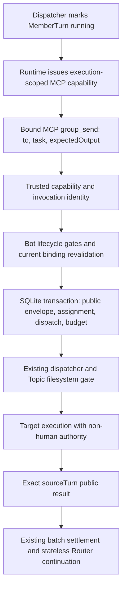
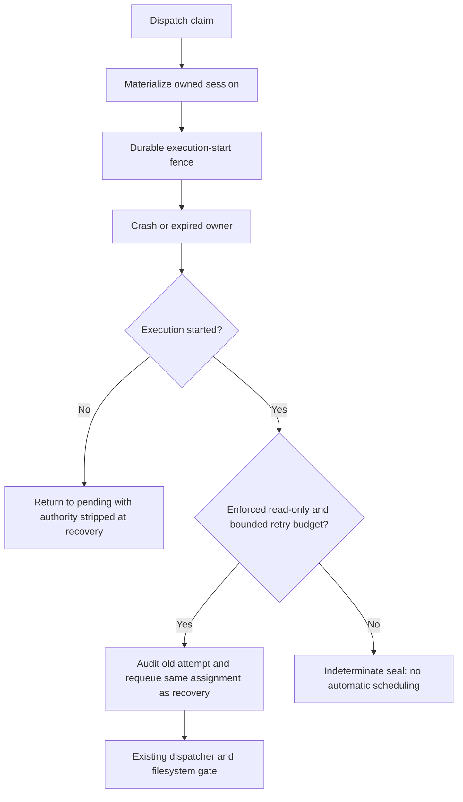

# PR9 implementation boundaries

Base: merged PR8, `6e7aa2ba4c27f6c4c375d5bc4bd4124decc20647`.

The actual execution chain uses the existing MemberTurn and dispatch lifecycle:

Recovery remains part of the dispatch store, not a second task runner:

The public tool never accepts sender, scope, Run, execution, authority or
idempotency fields. The MCP request identity supplies the invocation key;
retransmission of that invocation returns its durable receipt. Reusing a key
with different arguments fails closed. A fresh invocation is fresh work and
uses budget. This distinction never uses content equality for identity.

An explicit Group Run ends when all accepted work, including public handoffs,
settles. It never calls the Router. Automatic Runs continue through the same
stateless Router seam after all accepted work settles. Failed members are
quarantined only in this Run; healthy public evidence remains durable.

Private handoff, external bindings, cross-account routing, and continuation UI
are excluded. The local IPC trust boundary remains the documented OS-user
boundary; an execution capability is not an OS sandbox.

Self-review found the ordinary CommandRouter hidden-session guard also blocks
product Group execution when tested with the real ConsoleAgent rather than a
fake Agent. The narrow fix stamps the core-created metadata object's identity
in a WeakMap and checks exact Group/Bot/Topic/owned session/logical-session
scope. Private Control submit pins the alias. Copied/serialized metadata and
raw token strings cannot bypass the ordinary guard. A real ConsoleAgent +
CommandRouter + fake physical transport integration test exercises both the
sender and target, plus a forged direct call rejection.

Safe retry audits retired source identities. Self-review added failure and
physical-cancel fences alongside success fences: an old callback cannot fail
or cancel the queued/new attempt. A read-only sender with committed downstream
handoff is conservatively sealed because a filesystem proof does not prove
repeating orchestration safe. No production model assertion grants the enforced
effect proof; current new assignments remain potential writers.

The real transport path also revealed that ordinary-session error rendering
would turn a transport failure into a successful assistant error message.
Trusted Group execution propagates Runtime terminal failure and cancellation,
including typed permission refusal as a durable blocked failure. Unclassified
throws (including `undefined`) remain unknown outcomes through the existing
runner to the indeterminate seal. Real ConsoleAgent/CommandRouter integration
tests cover these outcomes and retain the healthy sender result.

The WeakMap route is released in the runner's `finally`; retaining the original
metadata object after settlement cannot start another owned prompt. Explicit
unknown evidence dominates even a contradictory completed/failed runner label.

The first Linux/macOS CI run caught an ordinary pre-aborted prompt regression:
the Group error path performed an extra logical-session lookup even without a
Group capability. Capability checks now short-circuit before that lookup. The
existing ordinary Router golden fixture passes without changing its recording;
the trusted Group error/permission/sentinel integration cases remain covered.

PR374 review identified three gaps, now covered by regressions:

- PR8 in-flight explicit Group Runs retained their one-member budget. Real
  queued and claimed-not-started SQL fixtures were generated from unmodified
  PR8 source at the base commit, rather than stripping PR9 columns from a new
  Run. Their first recovered `group_send` completes. First schema upgrade now
  raises only nonterminal explicit Group budgets to at least 24, retaining
  larger budgets and preserving Direct/automatic/terminal rows. Marker and
  backfill commit atomically under the SQLite writer lock; interrupted
  migration rolls back and retries, and later opens never refill the budget
  or reset consumption. Failed store construction closes its SQLite handle.
- Group teardown for missing-Topic Runs now removes `recovery_attempts` inside
  the same transaction before deleting their Runs. The real ghost-topic
  `teardownGroupConversation` regression checks the audit table directly after
  the Group root disappears.
- Router commit, handoff commit and dispatcher consumption share
  `publicMessageMatchesRunScope`: a valid exact human request plus exact
  Conversation/Topic and pre-request sequence or current-Run identity.
  Corrupt explicit and handoff trigger rows borrowing a later Run's human
  request fail before provider start; Router commit rejects the same reference
  before creating any MemberTurn or dispatch. Healthy sender evidence survives.

## Full-review follow-up

The user requested independent full reviews. Durable/recovery and
runtime/lifecycle/Control/Relay/Web reviews completed; identity review confirmed
the MCP-to-IPC binding chain. An active cross-process identity experiment was
blocked by automatic safety review for possible cybersecurity risk before any
script or token read. Identity conclusions below rely on source inspection and
existing legal-interface tests, not an executed cross-process experiment.

Four confirmed Medium findings were repaired:

- `mapRun` decodes quarantine once with a strict parser. Malformed syntax,
  scalar/object/null JSON, mixed element types and empty raw fields throw
  `run_corrupt`. No quarantined member becomes eligible through a fallback.
  Tests cover handoff without work/debit, Router before model decision,
  execution-start rollback, and owner/lease recovery after reopen.
- Handoff checks current membership and target Bot existence before entering
  the permanent per-Bot lifecycle gate registry. Final gated checks remain
  authoritative. A 256-distinct-invalid-target regression proves no gate entry
  or budget debit, then confirms a valid target still commits. Stale membership
  without a Bot also rejects before allocation; existing removal/deletion races
  now occur after the unlocked precheck.
- Normal settlement and sealed late-proof classification share durable budget
  rejection handling. Unknown evidence remains `indeterminate`; proof removing
  every unknown outcome cannot erase `budget-exhausted`. Live human cancel
  retains the existing priority. No heuristic derives human authority from a
  cancelled sibling, and no marker/schema changes were added. Fifteen tests
  cover four proof entry points, completed/failed proof, reopen, consumption,
  cancellation and pending-sibling unknown evidence.
- Relay Web orders MemberTurn snapshots by `attempt` before same-attempt state
  precedence. New attempts clear retired source/start/finish/failure evidence
  while retaining assignment/task/dependencies; old attempts cannot overwrite
  a new source or reset its live trace through started/finished events.
  Thirteen regressions include thin legacy rows and reconnect discovery.

New regression tests were run against the unfixed implementation: the first
26 quarantine/lock tests, eight late-proof cases, and twelve Web cases failed.
The fixes made those tests pass; two restart/claim and seven additional
late-proof/cancel/unknown cases complete the new 56-case coverage.

Identity is scoped explicitly. `buildXacpxMcpServerSpec` puts the execution
capability in launch arguments. The IPC server passes no socket peer identity
to `dispatch`; it validates the bearer-named execution, not its presenting
process. The private metadata WeakMap protects the in-daemon hidden-session
route only. PR8's `docs/external-mcp.md` already trusts **any process running
as the daemon's OS user**, which includes same-user member subprocesses.
The bound tool rejects model identity arguments and retired tokens; it does
not protect mutually untrusted terminal-capable Bots that can obtain each
other's live capabilities. This stronger isolation requirement remains a
review decision, not a claimed security fix. Docs/comments no longer promise
that an old process cannot obtain another live token.

Ordinary output/tool/thought events have MemberTurn correlation without a
per-attempt source field. Arbitrarily reordered cross-attempt stream frames
would require a wider wire change. Production currently grants no enforced
read-only proof to model-created assignments, so started retries are not
enabled on that path; this is recorded as a residual seam, not a confirmed
current production finding.

## Second independent full review

The second review starts from `a9370c5330203502631a8fdc6180fdfeff2b3feb`
and covers the entire PR again across durable state/recovery,
execution/lifecycle/transports, and MCP/IPC/Control/Relay/Web. Identity inspection
uses source and legal interface tests within the documented OS-user boundary.

- Late reconciliation now rejects an audited retired source even when a safe
  retry has cleared its current source. A sibling can seal that queued retry
  before it starts; an old success or failure must not prove this unstarted
  attempt or falsely complete the Run. Sealed reconciliation also requires an
  actual start. Ten regressions cover retired/current completed and failed
  proof, reopen, unchanged durable rows and missing-source unstarted evidence;
  six cases failed before the fix. Current exact retry proof remains accepted.
- Runtime materialization and execution-start transactions re-read valid
  quarantine membership after awaited work. `member_quarantined` settles the
  claimed target as a durable pre-start failure, preserving healthy sender
  evidence and spending no additional reservation. Six regressions cover both
  fences, async hooks, reopen and eligible members. Two original reproduction
  cases failed before the fix. Normal single-consumer same-Bot scheduling has
  not been shown to create this race; this closes the durable revalidation
  contract under controlled state restoration.
- Web merges retire the member's live/output/completeness/truncation caches
  and its old source cache when the durable attempt increases, including
  discovery and reconnect paths without a start event. Four regressions cover
  queued detail, new start/finish, same-attempt updates and old truncation.
- A full Topic's 64-Run admission cap no longer prevents handoff inside an
  already admitted Run. Handoff retains deletion, execution identity and
  work-budget fences; fresh requests retain the cap. Five regressions cover
  replay/reopen, both deletion barriers, budget exhaustion, dispatch before
  later Runs and freeing exactly one admission slot; three failed before the
  fix. No admission limit was raised.
- Transcript trace lookup requires an exact source when the message provides
  one, within its Conversation/Topic/Run. Thin detail cannot replace a later
  assignment's canonical result with an earlier trace from the same Bot.
  Legacy messages without a source use only a unique same-Bot candidate.
  Four mounted public history/RPC regressions cover both rejection paths,
  exact trace rendering and compatible unambiguous legacy rendering; two
  failed before the fix.

These five confirmed Medium findings add 29 regressions. Fifteen reproduction
cases failed against the unfixed implementation. Pending detail RPCs cannot
refill retired trace caches: trace writes are synchronous snapshot/turn events,
and every asynchronous member detail merge uses the same attempt fence.

The old enforced-read-only worker settlement catch can reject a drain after
an external concurrent recovery retires its source. No normal production
entry point was found: model assignments receive no enforced proof, and the
single consumer waits for its active cohort before recovering again. This
remains a restricted seam, not a confirmed production finding.

## Runtime terminal-evidence follow-up

Review of exact HEAD `686dcb2faece706f468740da0fb3bdbdaf9fc6da` identified
one remaining Medium: the trusted Group handler preserved permission refusal
but wrapped Runtime's terminal `RUNTIME_TURN_FAILED` and
`RUNTIME_TURN_CANCELLED` in an unknown-outcome error. Both could seal the Run
as indeterminate despite provider terminal evidence.

The handler now passes all three Runtime terminal codes through, retaining the
legacy `PERMISSION_DENIED` alias. Control also marks the trusted Group's typed
Runtime cancellation in both its result and turn-finished event even without
a local abort; otherwise merely forwarding the error would classify it as a
failure. Idle timeout and ordinary/Direct cancellation behavior are unchanged.

Two regression cases failed on the reviewed HEAD and pass after this fix.
They use the real ConsoleAgent → CommandRouter → transport → Control →
Conversation dispatcher chain with injected typed transport errors and no
local abort. They verify failed/quarantine versus cancelled/no-quarantine,
terminal dispatches, the healthy sender result, and SQLite reopen. Existing
permission, generic transport-error and undefined-rejection cases still pass.

## Shutdown ordering follow-up (2026-10-06)

Review of exact HEAD `e4bbfe9bcb528dc07418358322ea740af2211835` identified
one Medium: shutdown revoked Group handoff capabilities before awaiting entered
operation leases. A `group_send` waiting on a real Bot lifecycle mutex could
then fail `group_execution_unknown` solely because shutdown cleared its token.
The same premature close could fail capability binding after durable start,
manufacturing a `started_result_unknown` seal without a provider outcome.

Shutdown now marks the runtime stopping, awaits entered leases, closes Bot
mutations and drains the Run service/dispatcher, then closes the handoff
service in `finally`. New public operations still fail at entry. Entered
handoffs retain their capability through commit, and already-started executions
retain the ability to bind and finish. A failed drain still revokes handoff
capabilities while propagating its original failure.

Three regression cases cover this contract. Two fail on the reviewed HEAD:
an entered leased send waits on the actual Bot lifecycle gate and commits before
shutdown returns; and shutdown begins from the production member-started
projection between durable start and capability binding, without a fault hook.
Both preserve durable evidence after reopen. The first also proves the committed
target stays pending rather than starting during shutdown. The third verifies
capability revocation, closed admission and shared shutdown failure after an
injected Run-drain failure.

## Automatic multi-member cancellation follow-up (2026-10-06)

Review of exact HEAD `8c36dbce47d428aae8c36b1cfc453cdddb0c4787` identified
one Medium: the provider cancellation's force-terminal flag was lost when a
sibling remained active. Cancelled-first settlement could resume the Router,
while cancelled-last settlement stopped the same batch. Cancellation also
unconditionally reported human-cancelled despite no human Stop or local abort.

Known execution cancellation now writes whole-Run intent in the same
transaction as its member outcome. Never-started siblings become cancelled
with completed dispatches, including a claimed sibling waiting for the writer
slot. Already-started siblings drain and retain their actual evidence. The
durable marker fences routing, handoff, claim/start and recovery independently
of settlement order; the dispatcher projects the newly cancelled siblings.
The final cancelled reason is execution-cancelled unless human Stop was
requested while the Run remained live. Existing outcome precedence is retained.

The additive internal `runs.cancellation_reason` column retains provenance
across an indeterminate seal and later exact evidence. It has no public DTO or
request field. Upgrade preserves legacy live human cancellation intent and
does not reset PR9 budgets. Legacy terminal evidence without provenance keeps
its existing human-cancelled fallback; no unavailable historical source is
inferred.

Nine new regressions cover both real ConsoleAgent → CommandRouter → transport
settlement orders (with no local abort), the normal serialized-writer path,
claimed/pending sibling fences and idempotent replay after reopen, unknown and
late completed/failed proof with execution or human provenance, and legacy
column upgrade without budget refill. The three production-path cases failed
on the reviewed HEAD. Both order cases admit actual provider calls using the
existing host-supplied enforced-read-only capability seam; model-created
assignments do not gain this proof. The serialized-writer case uses ordinary
production assignment metadata and confirms no sibling provider start or
second Router call. Native Node SQLite also passes five order/provenance/upgrade
scenarios.

## Validation and residual limits

- Automatic multi-member cancellation follow-up: **809** Conversation/Session/Control/MCP/wire DTO tests passed across 31 files, including nine new regressions. Native Node SQLite passed five additional cancellation order/provenance/migration scenarios. Root typecheck, root build (CLI/bridge/worker/plugin API), acpx import policy and diff checks passed. Exact new-HEAD CI is tracked in the PR/report.
- Shutdown ordering follow-up: **800** Conversation/Session/Control/MCP/wire DTO tests passed across 30 files, including the three new shutdown cases. Root typecheck, root build (CLI/bridge/worker/plugin API), acpx import policy and diff checks passed. Exact new-HEAD CI is tracked in the PR/report.
- Runtime terminal-evidence follow-up: **797** Conversation/Session/Control/MCP/wire DTO tests passed across 30 files, including both new red-to-green real ConsoleAgent transport cases. Root typecheck, root build (CLI/bridge/worker/plugin API), acpx import policy and diff checks passed. Exact new-HEAD CI is tracked in the PR/report.
- Second full review: **795** Conversation/Session/Control/MCP/wire DTO tests passed across 30 files, including **549** Conversation tests across 17 files. The four handoff/budget/retired/full-queue files have **137** passing cases; six additional quarantine-start cases pass.
- Relay Web: **1,957** passed across 147 files, including **79** Group store/trace cases. The independent execution/lifecycle/runner/filesystem/Control sweep has **291** passes across six files.
- Bun and native Node SQLite each passed the same nine retired-proof/full-queue scenarios. Root typecheck, Web vue-tsc, acpx import policy and diff checks passed. The MCP/IPC/DTO independent sweep has **178 passed / 1 failed**, retaining the same Windows named-pipe/Unix-chmod baseline below.
- All-package build and pinned real-acpx compatibility (**13 passed**, three files) passed on the second-review source. Exact-HEAD Linux/macOS/Web CI is tracked in the PR/report. No real WeChat Group smoke or live-provider retransmission was run.

First full-review checkpoint (`a9370c5`):

- **107** handoff/recovery tests plus **15** budget late-proof tests; **528** Conversation tests across 14 files, all passed.
- Session handler, Control turn runner/queue, all MCP tests and wire DTO sweep: **246** passed across 13 files. Including the orchestration server gives **281 passed / 1 failed** across 14 files; its Windows-only `socket chmod failure is non-fatal and reported` failure matches the previously recorded clean-main baseline.
- Final combined Conversation/Session/Control/MCP/wire DTO run after package builds: **774** passed across 27 files.
- Relay Web full suite: **1,949** passed across 147 files; Group store: **71** passed. Independent runtime/lifecycle/runner/API/filesystem review checks: **249** passed across 5 files.
- Native Node SQLite follow-up passed malformed quarantine read/claim/reopen and completed/failed late proof with a persistent exhausted budget. Actual PR8 migration/rollback/audit checks also passed on the current source. Latest typecheck, all-package build, acpx import policy and diff checks passed; exact-HEAD CI is tracked in the PR/report.

Earlier phase validation (before the full-review follow-up):

- Handoff/recovery file: 79 passing tests; Conversation suite: 485 passing tests. Review remediation adds 18 cases.
- Final Conversation + Session handler + abort + MCP server + wire DTO sweep: 600 passing tests across 17 files.
- The existing ordinary Router pre-aborted golden test passes locally without changing its recording. Initial Linux/macOS CI failed only at that regression; the final exact-HEAD CI status is recorded in the PR/report.
- Relay Web: 1,936 passing tests across 147 files (includes two new public envelope/reconnect/quarantine cases).
- Extended affected sweep: 189 files, 2,811 passed, 55 failed, 1 skipped. This snapshot preceded the final five additional handoff identity/unknown cases; those are covered in the final 600-test sweep. Every one of the 55 failure names reproduced on clean merged main `6e7aa2ba4c27f6c4c375d5bc4bd4124decc20647` under Windows/Bun 1.4.2/Node 24.21.0. Comparison found zero PR-only failures. The original ordinary hidden-session test added here failed during development and was fixed; it passes in the final sweep and is not counted as baseline.
- `npm test` stops at the existing Hermes Linux file-URL fixture on Windows; the clean merged-main run fails at the same test. Other baseline failures concern golden fixture paths, Windows home/worktree path expectations, Unix chmod assumptions, IPC/terminal lock timing, RMUX probe fixtures and adapter-registry CLI expectations. They are not reported as green.
- `bunx tsc --noEmit`, `bun run build:packages`, final root `bun run build`, acpx import policy and `git diff --check`: passed. All-package build includes Web vue-tsc, protocol declarations/runtime export assertions, relay bundle and channel packages.
- Pinned real-acpx compatibility: 13 passing tests. Release-boundary command fails before executing on Windows (`spawnSync bun` ENOENT); the same clean-main command reproduces this limitation. Linux CI owns its execution.
- Real acpx + WeChat Group handoff smoke, live provider lost-response retransmission, and local Linux/macOS/native RMUX platform tests were not run. Exact-HEAD GitHub CI status is recorded in the PR/report.

Adversarial coverage includes strict sender/scope spoof and bounded malformed
input; immutable old execution rejection; live/copy/retired metadata authority;
nonmember/disabled/deleted/removal and deleting races; cancel during commit and
active physical execution; permission blocking; healthy evidence plus Run-only
quarantine/failover; frozen cross-Topic/Direct/future-result exclusion; same-Bot
multi-assignment; single-writer scheduling; transactional rollback; pending and
claimed-not-started restart; committed response replay; dropped result event;
retired success/failure/cancel evidence; enforced read-only one-retry policy;
writer indeterminate seal; durable loop/retry budget; mixed PR8 schema reopen;
verified teardown; and rejection with `undefined`.

Exactly-once is scoped to a durable runtime invocation identity. A host must
retransmit the same invocation ID after a lost response; a new model call with
a new host request ID is new budgeted work. Reusing IDs for unrelated calls
fails closed on argument conflict. Restart revokes old execution capabilities
and resumes committed downstream work; it does not revive an unknown sender.
No production proof currently enables read-only retry for model-created
assignments. Local IPC remains a same-OS-user boundary. Private handoff,
external/channel binding and continuation UI remain deferred.
