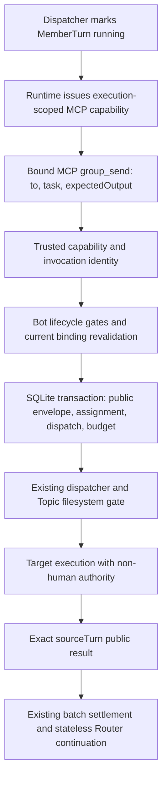
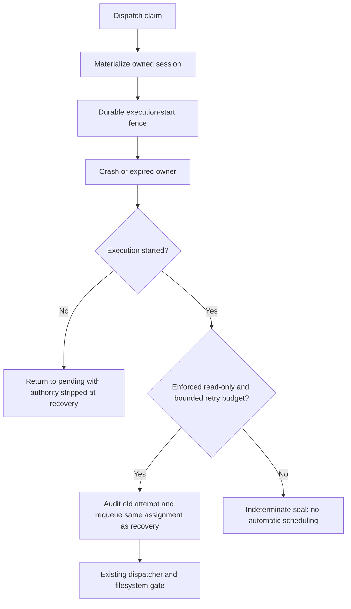

# PR9 implementation boundaries

Base: merged PR8, `6e7aa2ba4c27f6c4c375d5bc4bd4124decc20647`.

The actual execution chain uses the existing MemberTurn and dispatch lifecycle:

Recovery remains part of the dispatch store, not a second task runner:

The public tool never accepts sender, scope, Run, execution, authority or
idempotency fields. The MCP request identity supplies the invocation key;
retransmission of that invocation returns its durable receipt. Reusing a key
with different arguments fails closed. A fresh invocation is fresh work and
uses budget. This distinction never uses content equality for identity.

An explicit Group Run ends when all accepted work, including public handoffs,
settles. It never calls the Router. Automatic Runs continue through the same
stateless Router seam after all accepted work settles. Failed members are
quarantined only in this Run; healthy public evidence remains durable.

Private handoff, external bindings, cross-account routing, and continuation UI
are excluded. The local IPC trust boundary remains the documented OS-user
boundary; an execution capability is not an OS sandbox.

Self-review found the ordinary CommandRouter hidden-session guard also blocks
product Group execution when tested with the real ConsoleAgent rather than a
fake Agent. The narrow fix stamps the core-created metadata object's identity
in a WeakMap and checks exact Group/Bot/Topic/owned session/logical-session
scope. Private Control submit pins the alias. Copied/serialized metadata and
raw token strings cannot bypass the ordinary guard. A real ConsoleAgent +
CommandRouter + fake physical transport integration test exercises both the
sender and target, plus a forged direct call rejection.

Safe retry audits retired source identities. Self-review added failure and
physical-cancel fences alongside success fences: an old callback cannot fail
or cancel the queued/new attempt. A read-only sender with committed downstream
handoff is conservatively sealed because a filesystem proof does not prove
repeating orchestration safe. No production model assertion grants the enforced
effect proof; current new assignments remain potential writers.

The real transport path also revealed that ordinary-session error rendering
would turn a transport failure into a successful assistant error message.
Trusted Group execution now propagates typed permission refusal as a durable
blocked failure, and carries other throws (including `undefined`) as unknown
outcome through the existing runner to the indeterminate seal. Real Router
integration tests cover all three cases and retain the healthy sender result.

The WeakMap route is released in the runner's `finally`; retaining the original
metadata object after settlement cannot start another owned prompt. Explicit
unknown evidence dominates even a contradictory completed/failed runner label.

The first Linux/macOS CI run caught an ordinary pre-aborted prompt regression:
the Group error path performed an extra logical-session lookup even without a
Group capability. Capability checks now short-circuit before that lookup. The
existing ordinary Router golden fixture passes without changing its recording;
the trusted Group error/permission/sentinel integration cases remain covered.

## Validation and residual limits

- Handoff/recovery file: 61 passing tests; Conversation suite: 467 passing tests.
- Final Conversation + Session handler + abort + MCP server + wire DTO sweep: 582 passing tests across 17 files.
- The existing ordinary Router pre-aborted golden test passes locally without changing its recording. Initial Linux/macOS CI failed only at that regression; the final exact-HEAD CI status is recorded in the PR/report.
- Relay Web: 1,936 passing tests across 147 files (includes two new public envelope/reconnect/quarantine cases).
- Extended affected sweep: 189 files, 2,811 passed, 55 failed, 1 skipped. This snapshot preceded the final five additional handoff identity/unknown cases; those are covered in the final 582-test sweep. Every one of the 55 failure names reproduced on clean merged main `6e7aa2ba4c27f6c4c375d5bc4bd4124decc20647` under Windows/Bun 1.4.2/Node 24.21.0. Comparison found zero PR-only failures. The original ordinary hidden-session test added here failed during development and was fixed; it passes in the final sweep and is not counted as baseline.
- `npm test` stops at the existing Hermes Linux file-URL fixture on Windows; the clean merged-main run fails at the same test. Other baseline failures concern golden fixture paths, Windows home/worktree path expectations, Unix chmod assumptions, IPC/terminal lock timing, RMUX probe fixtures and adapter-registry CLI expectations. They are not reported as green.
- `bunx tsc --noEmit`, `bun run build:packages`, final root `bun run build`, acpx import policy and `git diff --check`: passed. All-package build includes Web vue-tsc, protocol declarations/runtime export assertions, relay bundle and channel packages.
- Pinned real-acpx compatibility: 13 passing tests. Release-boundary command fails before executing on Windows (`spawnSync bun` ENOENT); the same clean-main command reproduces this limitation. Linux CI owns its execution.
- Real acpx + WeChat Group handoff smoke, live provider lost-response retransmission, and local Linux/macOS/native RMUX platform tests were not run. Exact-HEAD GitHub CI status is recorded in the PR/report.

Adversarial coverage includes strict sender/scope spoof and bounded malformed
input; immutable old execution rejection; live/copy/retired metadata authority;
nonmember/disabled/deleted/removal and deleting races; cancel during commit and
active physical execution; permission blocking; healthy evidence plus Run-only
quarantine/failover; frozen cross-Topic/Direct/future-result exclusion; same-Bot
multi-assignment; single-writer scheduling; transactional rollback; pending and
claimed-not-started restart; committed response replay; dropped result event;
retired success/failure/cancel evidence; enforced read-only one-retry policy;
writer indeterminate seal; durable loop/retry budget; mixed PR8 schema reopen;
verified teardown; and rejection with `undefined`.

Exactly-once is scoped to a durable runtime invocation identity. A host must
retransmit the same invocation ID after a lost response; a new model call with
a new host request ID is new budgeted work. Reusing IDs for unrelated calls
fails closed on argument conflict. Restart revokes old execution capabilities
and resumes committed downstream work; it does not revive an unknown sender.
No production proof currently enables read-only retry for model-created
assignments. Local IPC remains a same-OS-user boundary. Private handoff,
external/channel binding and continuation UI remain deferred.
