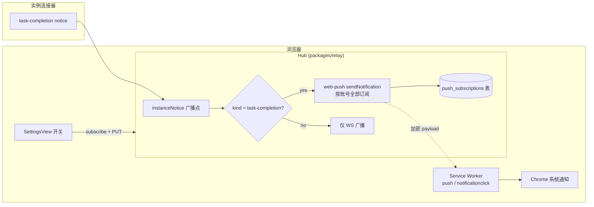

# Web Push 任务完成桌面通知（task-completion → Chrome 系统通知）设计

日期：2026-08-24
状态：已评审（用户选定：范围 A「仅 task-completion」+ 方案 3「Web Push + 服务端订阅」）

## 1. 目标 / 非目标

**目标**：实例产生 `task-completion` notice 时，即使标签页在后台甚至已关闭，Chrome 桌面弹系统通知；点击通知回到看板（路由恢复依赖现有 `loadPersistedSelection`）。

**非目标（YAGNI，明确排除）**：

- `task-progress` / `coordinator-message` 推送（范围 A）
- iOS Safari / 非 Chrome 浏览器适配
- 通知内操作按钮（action buttons）
- 离线补发队列：离线实例不产生新 completion，无需排队

## 2. 架构总览



关键事实：

- relay-web 已是 PWA（`vite-plugin-pwa`，`main.ts` 显式注册 SW），SW 基础设施现成。
- WS 只在页面存活时收事件——这正是需要 Web Push 的原因，也是为什么推送必须由 hub 发起而不是浏览器轮询。

## 3. Hub 侧（packages/relay）
- CLI 子命令 `xacpx-relay push-keys generate`：调用 `web-push.generateVAPIDKeys()` 打印 `{subject, publicKey, privateKey}`。配置经 **环境变量**（`XACPX_RELAY_VAPID_SUBJECT` / `XACPX_RELAY_VAPID_PUBLIC_KEY` / `XACPX_RELAY_VAPID_PRIVATE_KEY`）或 `start` 子命令同名 flag 注入——hub 现状不读任何 config.json（零配置文件设计），故不引入配置文件机制。

### 3.1 存储


新表 `push_subscriptions`：

```sql
CREATE TABLE IF NOT EXISTS push_subscriptions (
  account_id TEXT NOT NULL,
  endpoint   TEXT NOT NULL UNIQUE,
  p256dh     TEXT NOT NULL,
  auth       TEXT NOT NULL,
  created_at TEXT NOT NULL,
  PRIMARY KEY (account_id, endpoint)
);
```

配套 `PushSubscriptionStore`（src/stores/push-subscriptions.ts，仿 accounts.ts 模式）：upsert / listByAccount / deleteByEndpoint / deleteByEndpointAndAccount / pruneByAccount（账号删除级联时调用，与现有手动级联惯例一致——db.ts FK 默认关闭是代码库不变量）。

### 3.2 VAPID 配置

- 新增依赖：`web-push`（packages/relay dependencies）。
- CLI 子命令 `xacpx-relay push-keys generate`：调用 `web-push.generateVAPIDKeys()` 打印 `{subject, publicKey, privateKey}`。用户自行写入 config.json 的 `webPush` 段（`{subject, publicKey, privateKey}`）或对应环境变量。
- **不自动生成**：私钥是敏感配置；重启换钥会让全部订阅失效（endpoint 绑定 applicationServerKey）。未配置时推送功能静默禁用 + 启动 log warn，WS 通道完全不受影响。
- config schema 文档同步：docs/config-reference.md 增加 `webPush` 段说明。

### 3.3 HTTP API（挂进 http/app.ts，全部 authed；POST/PUT/DELETE 走既有 `requireJson` CSRF 门）

| 方法 | 路径 | 行为 |
|---|---|---|
| GET | `/api/web-push/vapid-public-key` | `{publicKey: string \| null}`（null = hub 未配置推送） |
| PUT | `/api/web-push/subscriptions` | body 为浏览器 `PushSubscription.toJSON()`；深度校验 `endpoint`(https URL)、`keys.p256dh`、`keys.auth` 后 upsert（幂等） |
| DELETE | `/api/web-push/subscriptions` | body `{endpoint}`；删当前账号下该 endpoint |

校验失败一律 400；与 `/api/login`、RPC 同一鉴权网关之后注册（无新增豁免）。

### 3.4 发送点（server.ts）

现有 `MSG.instanceNotice` 分支（broadcast notice 之后）：当 `payload.kind === "task-completion"` 时异步 fan-out：

- 读该实例所属账号的全部订阅（instanceNotice 本就按账号广播，归属关系已有）。
- `webpush.sendNotification(sub, payloadJson, { TTL: 3600 })`，payload：
  `{title: <instance 名>, body: <notice.text 截断 ~200 字符>, instanceId, url: "/"}`。
- **await 无关持久化**：fan-out 不阻塞 broadcast/持久化路径；单条失败只 log warn。
- **410 / 404 Gone → 删除该订阅行**（标准过期清理）；其他错误不重试。
- 未配置 VAPID 或无订阅时零成本短路。

### 3.5 安全考量

- 订阅端点是弱凭证（拿到可向该浏览器发垃圾推送）：API 强制登录态；数据按 account_id 隔离。
- 推送正文不含超出既有 WS 广播的信息（notice.text 本就推给同账号）。
- endpoint 强制 https（web-push 库本身也要求）。

## 4. Web 侧（packages/relay-web）

### 4.1 Service Worker

- 新文件 `public/push-sw.js`：自包含监听
  - `push` 事件 → 解析 JSON → `showNotification(title, {body, tag, data:{url}})`；
  - `notificationclick` → `clients.matchAll` 聚焦已有窗口并 postMessage 导航，否则 `openWindow(url)`。
- 经 `pwa-options.ts` 的 `workbox.importScripts: ["/push-sw.js"]` 注入 generateSW 产物——不动 autoUpdate/skipWaiting 流程；`pwa.test.ts` 单一事实源断言继续有效（在该测试中补 importScripts 断言）。
- dev 环境 SW 被禁用（`devOptions.enabled:false` 是现状且保持），设置段显示「不支持」态即可。

### 4.2 订阅流程（SettingsView 新「桌面通知」段）

状态机（派生自环境探测 + localStorage 无需持久化——权限与订阅本身由浏览器/hub 持有）：

| 状态 | 判定 |
|---|---|
| `unsupported` | 无 `serviceWorker`/`PushManager`/`Notification`（dev、非安全上下文、Firefox 部分场景） |
| `server-disabled` | `GET vapid-public-key` 返回 null |
| `denied` | `Notification.permission === "denied"`，附 chrome://settings/content/notifications 恢复指引文案 |
| `idle` | 其余且有开关未开 |
| `subscribed` | `pushManager.getSubscription()` 非空 |

交互：

- 开启：`Notification.requestPermission()` → `pushManager.subscribe({userVisibleOnly:true, applicationServerKey: urlBase64ToUint8Array(pk)})` → PUT 订阅到 hub。
- 关闭：`subscription.unsubscribe()` → DELETE。
- 权限拒绝不是报错：进入 denied 态明示原因与恢复路径。

### 4.3 对账（main.ts）

SW 注册成功后调 `getSubscription()`：存在订阅则静默 PUT 给 hub（hub 重启丢库或换钥后浏览器侧自愈）。逻辑抽 `lib/web-push.ts`（urlBase64ToUint8Array、对账函数），vitest 可测。

### 4.4 i18n

`i18n/messages/zh-CN.ts` 与 `en.ts` 补 settings.notifications.* 文案（段标题、各状态说明、开启/关闭按钮、恢复指引）。

## 5. 错误处理汇总

| 场景 | 行为 |
|---|---|
| hub 未配 VAPID | 设置页显示 server-disabled；GET 返回 null；发送点短路 |
| 权限被拒 | UI 明示 + 恢复指引，不再重复请求 |
| subscribe 失败（如 Chrome 要求 gcm sender 场景异常） | 回退 idle 态 + toast 错误文案 |
| 推送 410/404 | hub 删订阅行；下次对账自动重建 |
| 推送网络失败 | 单条 warn，不重试，不影响 WS |

## 6. 测试计划

- packages/relay（tests/unit/packages/relay）：
  - PushSubscriptionStore CRUD + 账号级联清理；
  - 三个路由：鉴权（401）、形状校验（400）、PUT 幂等 upsert；
  - notice→fan-out：mock `web-push.sendNotification`，断言仅 task-completion 触发、payload 形状、TTL；断言 410 后订阅行被删除。
- packages/relay-web（vitest）：
  - `lib/web-push.ts`：urlBase64 解码正确性；对账函数在有/无订阅、hub 失败时的行为；
  - SettingsView 通知段：mock pushManager/Notification/fetch，覆盖五个状态的渲染与切换动作；
  - `pwa.test.ts` 补 importScripts 断言。
- 手工 runbook（写入 spec 附注）：构建 → `xacpx-relay push-keys generate` → 配置 → 真实 Chrome 订阅 → dry-run 触发 task-completion → 断言系统通知弹出、点击聚焦回看板。

## 7. 阶段边界

纯增量：旧 hub 忽略新 web 的 PUT（无路由→404，设置页显示不可用）；新 hub 对旧 web 零影响。协议包不动（订阅不经实例连接器，属 hub↔浏览器私有面）。
